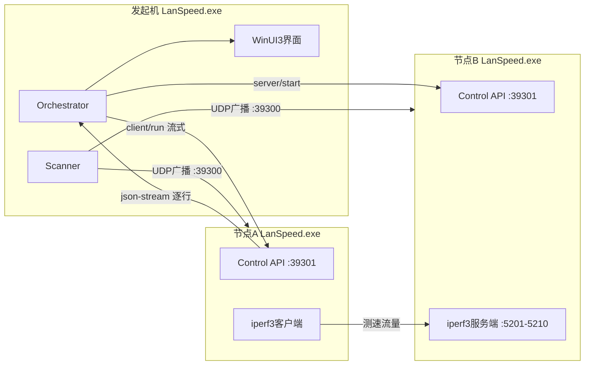

# 内网测速（LanSpeed）：Windows 局域网测速工具 — 设计文档

> 本文档自包含，位于新仓库 `docs/DESIGN.md`，不依赖 1Panel 仓库。附录 A 已与 1Panel 源码逐条核对，差异与新增设计均在文中标注。
> 技术栈：C# / .NET 10 LTS / WinUI 3（Windows App SDK）/ CommunityToolkit.Mvvm / SQLite / 内置 iperf3 3.22。
> 平台：**仅 Windows 10 1809+**（不做 Linux / macOS 节点；跨平台场景继续用 1Panel）。
> 状态：引擎与对等节点架构已落地；产品面按 Windows-only 重做——软配对（SQLite）、历史上限 100、Win11 Mica、低于千兆排查标记（不拦截开测）。更新检查走 GitHub Releases（仅 amd64；低于最低版本强制更新，否则可选）。正式代码签名仍待发布时更换。

---

## 0. 交接清单（从 Mac 带到 Windows 的东西）

> 2026-10-08：下表资源已从本机 1Panel 仓库搬运完成并核对校验值，此节仅作来源记录。

| 文件 | 来源（1Panel 仓库） | 放到新仓库 |
|---|---|---|
| 本文档 | `docs/lanspeed-windows-handoff.md` | `docs/DESIGN.md` |
| `iperf3.exe` | `internal/iperfres/bin/win64/iperf3.exe` | `assets/iperf3/win64/iperf3.exe` |
| `cygwin1.dll` | `internal/iperfres/bin/win64/cygwin1.dll` | `assets/iperf3/win64/cygwin1.dll` |
| iperf3 输出样本 ×4 | `internal/speedtest/testdata/*.jsonl` | `tests/LanSpeed.Core.Tests/TestData/` |

iperf3 文件校验值（SHA256）：

```
bcafba4aff825fa94685b6b3d049f8b1338c69e6dc1d06e6a00ac046191e4999  iperf3.exe
d66788fce4ef1ce787fc1a83f2dd1e063e58bbf0d48ad93164ee195a983c035e  cygwin1.dll
```

拿不到这两个文件时，可从 <https://github.com/ar51an/iperf3-win-builds/releases> 下载 3.22 的 win64 包解压获得（校验值可能不同，以实际下载为准并更新 `SHA256SUMS`）。

四个样本文件是 macOS 上 iperf3 3.22 `--json-stream` 的真实输出（`tcp_p2` 正向 2 流、`tcp_reverse` 反向、`tcp_bidir` 双向、`udp_bidir` UDP 双向），用于解析器单元测试。若没带过来，可在任意两台机器上用下面的命令重新生成（2 秒、2 流）：

```
iperf3 -c <ip> -p 5201 -t 2 -P 2 -i 1 --json-stream --forceflush            > tcp_p2.jsonl
iperf3 -c <ip> -p 5201 -t 2 -P 2 -i 1 --json-stream --forceflush -R         > tcp_reverse.jsonl
iperf3 -c <ip> -p 5201 -t 2 -P 1 -i 1 --json-stream --forceflush --bidir    > tcp_bidir.jsonl
iperf3 -c <ip> -p 5201 -t 2 -P 1 -i 1 --json-stream --forceflush --bidir -u -b 200M > udp_bidir.jsonl
```

---

## 1. 产品目标

### 要做

- 每台 Windows 安装同一个程序，常驻托盘，即可被局域网内其他电脑测速。
- 自动扫描局域网：列出在线主机的内网 IP，识别哪些主机装了本工具。
- **软配对**：发现后可「记住」主机，写入本地 SQLite；重启后按节点 ID 刷新 IP 并继续测速（无需账号、无需对方确认）。
- 选若干台主机组成分组，执行**星形**与**矩阵**测速，实时展示进度与结果，保存最近 **100** 条历史。
- **链路健康**：协商速率 &lt; 1000 Mbps 醒目标记为排查重点（百兆内网不应存在），**不拦截开测**。
- 不需要 SSH 或显式确认配对。

### 第一版不做

- 跨网段 / 跨 VLAN 的自动发现（只支持手动输入 IP）。
- 公网测速、NAT 穿透。
- 无人登录时被测（Windows 服务模式放到第二版）。
- macOS / Linux 客户端（跨平台继续用 1Panel）。

## 2. 已确定的决策

| 决策 | 选择 | 影响 |
|---|---|---|
| 产品名 | 用户可见名称「内网测速」；代码标识 `LanSpeed.*` | 窗口标题、托盘、exe 描述、MSIX 显示名用中文；命名空间与 MSIX 包标识用 ASCII |
| 平台范围 | **仅 Windows**（GUI + 可选 CLI） | Core/CLI/App 均为 Windows TFM；不做 Linux 系统 iperf3 / `-J` 回退产品路径 |
| 语言与运行时 | C#，.NET 10 LTS | Windows 系统 API 集成方便 |
| 界面 | WinUI 3（Windows App SDK），CommunityToolkit.Mvvm；Win11 Mica / Win10 回退 | 严格 Fluent；ThemeResource |
| 持久化 | SQLite（`%LOCALAPPDATA%\LanSpeed\lanspeed.db`） | 软配对主机 + 历史（上限 100） |
| 测速引擎 | 内置 iperf3 3.22（`iperf3.exe` + `cygwin1.dll`），固定 `--json-stream` | 需要管理子进程 |
| 链路健康 | &lt;1000 Mbps 标记排查，不拦截 | `LinkHealth` 分类；主机筛选「仅问题主机」 |
| 信任模型 | 不鉴权 | 用“允许被测”开关与资源上限兜底（§9） |
| 运行方式 | 托盘程序 + 开机自启；同一用户会话只运行一个进程 | 再次启动唤起已有窗口（已藏到托盘则重新显示）并立刻退出新进程，避免占用第二个控制端口；用户登录后才能被测 |
| 打包 | MSIX 优先；备选未打包 + WiX | MSIX 清单可声明防火墙规则与开机自启（§10） |
| 发布 | GitHub CLI（`gh release`），脚本 `packaging/publish.ps1` | 只上传 amd64（win-x64）MSIX 与 `update.json`；不制作、不上传 ARM |
| 更新 | 低于 `packaging/min-version.txt` **强制更新**，否则有新版本时**可选更新** | 数字比较 `major.minor.patch`；离线检查失败不锁死（§10.1） |
| 最低系统 | Windows 10 1809（17763）及以上，仅 x64（amd64） | 不提供 ARM 安装包；Windows App SDK 下限 17763 |

## 3. 整体架构

每台电脑运行同一个 `LanSpeed.exe`，节点对等，没有中心服务器。任意一台都能作为**发起机**：扫描、建分组、调度测试、展示结果；被选中的主机作为**被测节点**执行测速。发起机自己也能加入分组。



进程内结构：Generic Host 托管各后台服务，WinUI 3 只是其中一个前端；关闭窗口只隐藏到托盘，不退出进程。同一 Windows 登录会话只允许一个进程：入口在创建窗口前占住会话级互斥量，第二个进程通知已有实例显示主窗口后退出，不启动节点服务。

| 组件 | 职责 |
|---|---|
| DiscoveryService | UDP 39300：发送 / 响应发现广播 |
| Scanner | ping 扫描、ARP 表、端口探测、主机名解析、网卡过滤 |
| ControlServer | Kestrel（ASP.NET Core Minimal API），TCP 39301 |
| IperfRunner | iperf3 解压、校验、子进程管理（服务端 / 客户端）、Job Object |
| Orchestrator | 单对测速流程、星形 / 矩阵调度（仅发起机使用） |
| PairedHostStore | 软配对主机（SQLite，按节点 ID） |
| HistoryStore | 本地历史（SQLite，上限 100，CSV 导出） |
| LinkHealth | 协商速率分类：千兆及以上 / 低于千兆（排查） / 未知 |
| FirewallService | 网络类型与防火墙规则自检、修复 |

**控制接口不要用 `HttpListener`**：它监听非本机地址需要管理员做 urlacl 保留。用 Kestrel 内嵌在桌面进程即可。

### 端口

| 端口 | 协议 | 用途 |
|---|---|---|
| 39300 | UDP | 发现广播与应答 |
| 39301 | TCP | 控制接口（HTTP/JSON，客户端输出用流式响应） |
| 5201–5210 | TCP/UDP | iperf3 服务端，按需启动，测完即停 |

端口可在设置中修改；发现应答里带实际控制端口，发起机按应答值连接。

## 4. 局域网扫描与安装识别

两层并行，结果按 IP 合并成一张主机表。

### 4.1 第一层：发现已安装节点（UDP 广播）

- 发起机遍历物理网卡，对每个 IPv4 网段发定向广播（如 `192.168.1.255`）以及 `255.255.255.255`：

```json
{ "t": "discover", "v": 1, "id": "<发起机节点ID>" }
```

- 已安装节点单播应答：

```json
{
  "t": "hello",
  "v": 1,
  "id": "节点ID（首次启动生成的 GUID，持久化）",
  "name": "计算机名",
  "version": "1.0.0",
  "iperf": "3.22",
  "ips": [{ "ip": "192.168.1.23", "prefix": 24, "iface": "以太网", "speedMbps": 1000 }],
  "ctrlPort": 39301,
  "accept": true,
  "busy": false
}
```

- 节点启动和网卡变化时（`NetworkChange.NetworkAddressChanged`）主动广播一次 `hello`。
- 一轮等 1.5 秒应答；界面可“重新扫描”。
- 发送时用 `UdpClient` 并设置 `EnableBroadcast = true`，每块网卡单独绑定本机地址发送，否则多网卡时只会从默认网卡发出去。

### 4.2 第二层：扫出全部在线主机（含未安装）

- **网段范围**：每块物理网卡所在网段；掩码比 /22 更大时（比如 /16）只扫本机所在的 /22（最多约 1024 个地址）。
- **ping**：`System.Net.NetworkInformation.Ping.SendPingAsync`，并发上限 64，超时 800 ms，不需要管理员权限。
- **ARP 表**：P/Invoke `GetIpNetTable2`（`iphlpapi.dll`）读邻居表，补上不回 ping 的主机（Windows 默认防火墙拦截 ping 入站），同时拿到 MAC。排除 `NlnsUnreachable`、`NlnsIncomplete` 状态和广播 / 组播地址。
- **端口探测**：对所有在线 IP 请求 `GET http://<ip>:39301/v1/hello`（超时 1 秒），补充识别广播丢失的节点。
- **主机名**：`Dns.GetHostEntryAsync` 反向解析（超时 1.5 秒）。NetBIOS 节点状态查询（UDP 137）暂缓：路由器登记的名字经 DNS 反解已覆盖绝大多数家用场景，未覆盖的主机显示「—」。
- **厂商**（可选）：MAC 前 3 字节查内置 OUI 表。

### 4.3 主机状态

| 状态 | 判定 | 界面提示 |
|---|---|---|
| 已安装 · 可测 | 有 `hello`，`/v1/hello` 成功，`accept=true` | 可加入分组 |
| 已安装 · 拒绝被测 | 有应答，`accept=false` | 对方关闭了“允许被测” |
| 已安装 · 忙 | `busy=true` | 正在执行其他测试 |
| 已安装 · 控制端口不通 | UDP 有应答，TCP 39301 连不上 | 多半是防火墙，给出放行指引 |
| 已安装 · 版本不兼容 | `v` 不一致 | 提示升级 |
| 在线 · 未安装 | ping 或 ARP 有记录，无应答 | 显示安装指引 |
| 手动添加 | 用户输入 IP，按上述规则探测 | 用于跨网段 |

### 4.4 网卡过滤

默认排除：回环、`169.254.0.0/16`、`198.18.0.0/15`（代理 TUN 的 fake-ip 段）、`OperationalStatus != Up`，以及描述或名称包含以下关键字的网卡：`Hyper-V`、`vEthernet`、`WSL`、`VMware`、`VirtualBox`、`Docker`、`TAP-Windows`、`Wintun`、`WireGuard`、`Tailscale`、`ZeroTier`、`OpenVPN`、`Npcap Loopback`、`Bluetooth`。设置里可手动勾选纳入。

地址分类沿用 1Panel 规则：RFC1918 私网为 `lan`；`100.64.0.0/10` 为 `overlay`（Tailscale 等）；其余为 `wan`。第一版只用 `lan`。

## 5. 控制接口（Kestrel Minimal API）

> 新设计：1Panel 桌面版的测速通过 Wails 桥在本机 UI 与后端之间调用，没有 HTTP 控制接口；本节为 P2P 架构新增，无源码可移植，需自行验证。

只接受来自私有地址段（10/8、172.16/12、192.168/16，含回环 127/8 以支持本机自测）的请求，其余返回 403。

| 接口 | 说明 |
|---|---|
| `GET /v1/hello` | 节点信息（同发现应答） |
| `GET /v1/addrs` | 网卡列表：IP、前缀、网卡名、协商速率（`NetworkInterface.Speed`）、是否默认路由网卡 |
| `POST /v1/server/start` | 入参 `{port, maxSeconds}`（port=0 表示在 5201–5210 自动选）；返回 `{port, handle}` |
| `POST /v1/server/stop` | 入参 `{handle}` |
| `POST /v1/client/run` | 入参 `{target, port, bindIp, params, flow}`；以本机为客户端运行 iperf3，**流式返回** `--json-stream` 每一行（`text/plain` 分块传输，每行一个 JSON） |
| `POST /v1/client/stop` | 中止当前客户端 |
| `POST /v1/probe` | 入参 `{target, port}`；运行一次 iperf3 小流量探测（§6.4），返回 `{ok, rttMs, reason}` |
| `POST /v1/ping` | 入参 `{target}`；返回平均 RTT（毫秒），不可达为 0 |

约束：

- 每个节点同时最多一个 iperf3 客户端和一个服务端，否则返回 `409 busy`。
- 服务端带硬性存活上限 `maxSeconds`（发起机按下式下发：`时长 + 忽略秒数 + 60`，即流程层的 `Duration+Omit+30` 再加 30 秒余量），到期节点自行杀进程，避免发起机掉线后残留。
- `client/run` 的 HTTP 连接断开时，立即杀掉 iperf3 客户端进程。
- 不提供执行任意命令、读写文件的能力。

## 6. 测速执行

### 6.1 iperf3 管理

- **Windows Only**：`assets/iperf3/win64/` 作为 Content 随包分发；首次运行复制到 `%LOCALAPPDATA%\LanSpeed\iperf3\3.22\`，按 SHA256 校验，不一致就重写。`iperf3.exe` 与 `cygwin1.dll` 必须在同一目录。
  - 打包为 MSIX 时安装目录只读，但可以直接从安装目录运行，无需复制；未打包时复制到 LocalAppData。
- 产品路径固定 `--json-stream --forceflush`（内置 3.22）；不做 Linux 系统 iperf3 / `-J` 回退。
- 子进程：`ProcessStartInfo { CreateNoWindow = true, UseShellExecute = false, RedirectStandardOutput = true, RedirectStandardError = true }`。
- 所有 iperf3 进程加入一个 Job Object（`JOB_OBJECT_LIMIT_KILL_ON_JOB_CLOSE`），主程序退出或崩溃时 iperf3 一并结束。
- 服务端：`iperf3 -s -p <port>`；逐个尝试 5201–5210，启动后等 400 ms，进程仍存活即视为成功。**maxSeconds 到期杀进程时必须同时清空槽位状态**，否则节点会永远报 busy（实测踩过的坑）。
- 测速期间调用 `SetThreadExecutionState(ES_CONTINUOUS | ES_SYSTEM_REQUIRED)` 阻止系统睡眠，结束后恢复。
- **已知引擎缺陷**：cygwin 版在 127.0.0.1 上跑高带宽 UDP 报 `Resource temporarily unavailable`（低速率正常，跨机不受影响）。

### 6.2 单对测速流程（A → B，B 作服务端）

1. 发起机 → B：`server/start`，拿到端口。
2. 发起机 → A：`probe`，确认 A 能连到 B 的端口（失败则记录原因、`server/stop`、跳过本轮）。
3. 发起机 → A：`ping` B，记录 RTT（iperf3 Windows 版拿不到可靠 TCP RTT）。
4. 发起机 → A：`client/run`，A 执行 `iperf3 -c <B的IP> -B <A的同网段IP> ...`，逐行流回。
5. 发起机解析每行生成采样点推给界面；结束后汇总。
6. 发起机 → B：`server/stop`。

发起机本身是 A 或 B 时，对应步骤直接本地调用，不走 HTTP（抽象一个 `INodeClient` 接口，本地实现与 HTTP 实现各一个）。

### 6.3 测速参数

| 参数 | 范围 / 默认 | iperf3 参数 |
|---|---|---|
| 协议 | tcp / udp，默认 tcp | `-u` |
| 并行流数 | 1–64，默认 4 | `-P` |
| 时长 | 3–300 秒，默认 10 | `-t` |
| 方向 | forward / reverse / bidir，默认 forward | `-R` / `--bidir` |
| UDP 总目标带宽 | Mbps，0 不限 | `-b`（按流均分） |
| 端口 | 0 自动（5201–5210），或 1024–65535 | `-p` |
| 忽略开头秒数 | 0–10 | `-O` |
| 窗口 | KB，0 默认 | `-w` |
| MSS | 0–9000，仅 TCP | `-M` |
| 采样间隔 | 0.5 或 1 秒 | `-i` |

不支持拥塞控制 `-C`（Windows 无效）。固定附加 `--connect-timeout 3000 --json-stream --forceflush`。规整与组装规则见附录 A。

### 6.4 连通探测

`iperf3 -c <ip> -p <port> --connect-timeout 1500 -n 256K -J`（整体超时 6 秒；用传输固定 256KB 数据代替计时，更快更准）。结果判定见附录 A.6。

### 6.5 指标

- 吞吐、重传、UDP 抖动与丢包：来自 iperf3。
- RTT：来自 ping（Windows 版 iperf3 的 RTT 不可信，解析时 `trustRtt=false`）。
- CPU：iperf3 `end` 事件中的 `host_total`（客户端）与 `remote_total`（服务端）。
- 链路上限：两端网卡协商速率中较小者，用于结论评级。

## 7. 分组测速

| 模式 | 轮次 | 每轮方向 |
|---|---|---|
| 星形 | 中心机与其余每台各一轮，共 N−1 轮 | 双向同时（bidir），一轮得到两个方向 |
| 矩阵 | 所有有序对 N×(N−1) 轮 | 单向（forward） |

- 逐轮串行，不并发（并发互相抢带宽，结果失真）。
- 开测前显示预计耗时：轮数 ×（时长 + 约 3 秒准备）。
- 每轮先找“同网段”路径：B 的 `lan` 地址中，与 A 某个 `lan` 地址同网段的那个（附录 A.7）；没有就标记 `nolan`（不在同一网段），跳过。
- 每轮先探测；失败标记原因，不阻塞后续轮次。
- 可随时停止，已完成轮次保留。

本地分组是一层自由命名的机柜（名称自定，例如「3楼-财务室」），存在发起机 SQLite，不是当次扫描的临时勾选：

- 成员按节点 ID 记录，一台主机只属于一个分组。可摆放的主机 = 已记住的主机 + 本机（本机不必先点记住）。
- 未放入任何分组的主机显示在固定的「未分组」柜，该柜不入库。
- 分组顺序和柜内主机顺序都持久化。界面可拖动：柜内排序、跨柜搬移、柜子之间调顺序。可改名、删除；删除后主机回到未分组。重名不允许。
- 取消记住时同时去掉该节点的分组成员。IP 变化后通过发现重新匹配。
- 测速对象是选中的一柜。只解析该柜里当前在线且可测的主机（IP 取最近扫描，没有则用记住时的地址）；离线主机留在柜里、不参与本轮。至少 2 台才开测。低千兆只警告，不拦截。

每轮状态：`pending` → `probe` → `running` → `done` / `failed` / `nolan` / `stopped`。

## 8. 界面（WinUI 3）

视觉跟随 Windows Fluent 设计：Win11 `MicaBackdrop`、系统强调色、跟随系统深浅色（Win10 无 Mica 时用默认主题背景）。`NavigationView` + CommunityToolkit.Mvvm：

- **主机**：扫描；主机表（状态、计算机名、IP、MAC、版本、**链路健康角标**、**本地分组**）；软配对「记住 / 取消」；筛选「仅问题主机」（低于千兆）；已配对置顶；手动添加 IP。已归入机柜的扫描结果显示分组名，已记住但未归入的显示「未分组」。
- **两机**：A/B 从扫描与配对列表选择；任一侧低于千兆时显示警告条（**仍可开测**）；1Panel 风格报表 + LiveCharts2 曲线 + 评价。
- **分组**：一层本地机柜（自由命名）；记住的主机与本机拖入分组，未分组单独成柜；选中一柜后星形或矩阵测速；低千兆警告不拦截；逐轮进度。
- **结果**：
  - 星形：表格，每行一台，显示双向吞吐、RTT、重传 / 丢包、结论等级、链路健康。
  - 矩阵：N×N 热力图（`ItemsRepeater`），单元格为“行 → 列”吞吐，颜色按结论等级；点击查看单对详情。
  - 单对详情：吞吐曲线（LiveCharts2）、汇总、结论文字；`LinkMbps &lt; 1000` 时评价 notes 追加排查提示。
- **历史**：列表、详情、删除、导出 CSV（SQLite，上限 100）。
- **设置**：允许被测、端口、网卡过滤、防火墙自检与修复、开机自启、检查更新（§10.1：启动时检查；低于最低版本的对话框不可跳过）。

托盘（H.NotifyIcon.WinUI）：图标区分空闲 / 被测中；菜单含“允许被测”开关、打开主界面、中止当前测速、退出。被测状态由图标与 tooltip 表达，可从托盘中止（气泡通知的实现说明见下方踩坑记录）。

> 实现说明（2026-10-08，Windows-only 重做后续）：六页与托盘——主机（自动扫描、软配对、低于千兆角标与筛选）、两机（配对列表 + 链路警告条不拦截 + 1Panel 风格报表 + LiveCharts2）、分组（低千兆警告不拦截）、结果（矩阵 N×N 热力 + 轮次表）、历史（SQLite 上限 100）、设置。Win11 `MicaBackdrop`；CommunityToolkit.Mvvm 已引入。关闭窗口隐藏到托盘。注意 WinUI 页面事件在 InitializeComponent 中途即可能触发，处理函数必须做「页面就绪」守卫。
>
> 单实例（2026-10-09）：`Program.Main` 在 `Application.Start` 之前用 `Local\LanSpeed.SingleInstance` 占位。已有进程时，新进程放开前台权限、置位 `Local\LanSpeed.ShowMainWindow`，并用 `AppInstance` 把激活转交后退出。已有实例在 UI 线程 `Show` + `Activate`。互斥量被遗弃（上次崩溃）时由新进程接管，不锁死启动。
>
> 本地分组（2026-10-09）：`host_groups` / `host_group_members` 按节点 ID 记住机柜与顺序。分组页用换行卡片拖动调整；对选中的一柜开测，离线成员不参与。

> 图标与托盘踩坑（2026-10-08，Win10 19044 实测）：
> 1. **窗口图标**：WinUI 3 桌面窗口类（`WinUIDesktopWin32WindowClass`）注册时不带图标，exe 内嵌图标不会自动成为窗口图标——标题栏、任务栏、Alt-Tab 全部空白。必须在窗口构造时 `AppWindow.SetIcon(<安装目录>\Assets\app.ico)`（csproj 已把 `Assets\*.ico` 作为 Content 复制，打包/未打包路径一致取 `AppContext.BaseDirectory`）。
> 2. **托盘 IconSource 不可用**：H.NotifyIcon.WinUI 2.4.1 的 `IconSource`（ImageSource）走「ms-appx URI → 文件流 → `new Icon(stream, DPI 尺寸)`」异步链（async void），任一环失败即静默丢图标。改为同步 `System.Drawing.Icon` 直读 ico 文件赋 `Tray.Icon`（`GetSystemMetrics(SM_CXSMICON)` 取尺寸，条目不匹配回退默认条目）。
> 3. **库注册自带 NIS_HIDDEN**：H.NotifyIcon 的 `TryCreate` 硬编码 `dwState=1(NIS_HIDDEN)`，部分 Win10 explorer 不接受事后 `NIM_MODIFY` 翻回可见。修复：窗口加载后按 GUID `NIM_DELETE` + 无 `NIF_STATE` 的干净参数 `NIM_ADD` 重注册（沿用库消息窗口与 1024 回调、`NIM_SETVERSION(4)`，右键菜单/双-click 不受影响）。
> 4. **NIM_MODIFY 一律不用**：实测该机器 explorer 对按 GUID 的 `NIM_MODIFY`（换图标、改 tip、`NIF_INFO` 气泡）返回成功但移除图标。因此忙/闲切换与 tooltip 变更一律走「DELETE + 干净 ADD」重注册；被测气泡通知（`Tray.ShowNotification` 底层即 `NIF_INFO`）已移除，「正在被测」由绿徽章图标 + tooltip 表达。
> 5. 交给 explorer 的 HICON 必须长活：`Tray.Icon` 属性每次变更会 Dispose 旧 `System.Drawing.Icon`（DestroyIcon explorer 正在引用的句柄），故重注册一律用 `LoadImage(LR_LOADFROMFILE)` 的独立句柄。

## 9. 不鉴权下的安全兜底

- **允许被测**开关默认开启；关闭后控制接口只保留 `hello`（`accept=false`），其余返回 403。
- 只接受来自私有地址段的请求。
- 单次时长上限 300 秒、并行流上限 64、同时只允许一个测试。
- 被测时托盘图标变化（绿徽章）并提示（气泡通知因 §8 踩坑 4 移除，状态由图标与 tooltip 表达），可一键中止。
- 接口只能启停 iperf3 和 ping，不能执行命令、读写文件。
- 预留：后续可加“团队口令”HMAC 签名请求头，向后兼容。

## 10. Windows 环境适配

| 风险 | 表现 | 对策 |
|---|---|---|
| 防火墙 / 网络为“公用” | 发现无应答、端口不通 | **MSIX**：清单中用 `desktop2:FirewallRules` 为 `LanSpeed.exe`、`iperf3.exe` 声明入站规则（UDP 39300、TCP 39301、TCP/UDP 5201–5210），安装时自动添加、卸载时清理。**未打包**：安装程序以管理员身份通过 COM `INetFwPolicy2` 添加规则。程序内用 COM `INetworkListManager` 读当前网络类型，“公用”时提示切换为“专用”或一键放行（UAC 提权） |
| Wi-Fi AP 隔离 / 访客网络 | 能扫到主机，但所有连接失败 | 识别“ARP 有记录、全部端口不通”的情况，提示可能开启了 AP 隔离 |
| 多网卡 | 测速走错网卡 | 客户端加 `-B <同网段本机IP>` |
| 杀毒软件 | 扫描被拦截或误报 | 扫描限速；exe 与安装包代码签名 |
| ICMP 被拦截 | ping 漏主机、RTT 为 0 | ARP 表补在线判定；RTT 缺失显示“—” |
| 休眠 / 锁屏 | 节点中途掉线 | `SetThreadExecutionState` 阻止睡眠 |
| 回环高带宽 UDP | 127.0.0.1 上高速 UDP 报 `unable to read from stream socket: Resource temporarily unavailable`（2026-10-08 实测，裸 iperf3 同样复现，低速率如 10 Mbps 正常） | cygwin 版引擎的固有限制，跨机器不受影响；单机自检 UDP 用低速 |
| 开机自启 | — | MSIX 用 `desktop:StartupTask`；未打包写 `HKCU\...\Run` |

### 10.1 发布与更新

发布渠道是 GitHub 仓库 `itjun/itjun-speed` 的 Releases，只用 GitHub CLI，不另建更新服务器。架构只做 **amd64**（`win-x64`）。不编译、不上传、不安装 ARM / ARM64 包；文件名含 `arm`（不区分大小写）的资产直接丢弃。客户端即使跑在 ARM 设备的 x64 模拟上，更新包仍只取 amd64。

版本号：

- 产品版本是 `Directory.Build.props` 的 `<Version>`，三段 `major.minor.patch`。
- MSIX `Identity/@Version` 为四段，前三段与产品版本相同，第四段固定 `0`（例如 `0.2.0` → `0.2.0.0`）。客户端比较时忽略第四段、忽略单个前缀 `v` / `V`。
- 最低版本是仓库文件 `packaging/min-version.txt`（一行三段版本号）。它必须 **小于或等于** 正在发布的版本。发布脚本在调用 `gh` 之前做这项检查，不通过就中止。

`packaging/publish.ps1` 的发布物只有两个：

| 资产 | 内容 |
|---|---|
| `LanSpeed-<version>-win-x64.msix` | Release 配置打出的 x64 MSIX（自签名测试证书；正式环境换代码签名证书） |
| `update.json` | `version`、`minVersion`、`arch`（固定 `amd64`）、`file`（上表文件名） |

发行说明首行固定为 `minVersion: x.y.z`，供人阅读。客户端以 `update.json` 为准；没有该资产时才退回发行说明首行。`update.json` 的 `version` 必须与标签 `vX.Y.Z` 一致，`file` 必须就是该发布里的 amd64 `.msix`。

检查地址默认 `GET https://api.github.com/repos/itjun/itjun-speed/releases/latest`（匿名可读，因此发布不能是 draft / prerelease）。`settings.json` 的 `updateCheckUrl` 只用于把这一 API 换成另一个 https 地址，下载地址仍然只接受：

`https://github.com/itjun/itjun-speed/releases/download/<tag>/<amd64.msix>`

判定（当前 C、发布版本 L、最低版本 M；按数字比较，不用字符串）：

| 条件 | 结果 |
|---|---|
| 检查失败，或尚无 Release | 不更新。内网机器经常上不了 GitHub，**不得**因此锁死 |
| C &lt; M | **强制更新**。对话框只有「立即更新」和「退出」，不能继续使用。仅当 L &gt; C 且存在受信任的 amd64 包时才下载；否则提示没有可用安装包，仍只能重试或退出 |
| C ≥ M 且 L &gt; C | **可选更新**。可以稍后 |
| 其余（已是 L 或比 L 更新） | 无更新 |

下载后用系统打开该 `.msix`（应用安装程序），然后退出本进程，避免文件被占用。控制接口不增加下载或拉起安装包的能力。

## 11. 开发环境（Windows）

1. Windows 10 1809+ 或 Windows 11，x64。不提供 ARM 安装包。
2. 安装 .NET 10 SDK。
3. 安装 Visual Studio 2026，勾选“WinUI 应用程序开发”工作负载（WinUI 3 的调试、XAML 热重载和 MSIX 打包依赖它）。日常用 Cursor 写代码，用 Visual Studio 运行调试界面。
4. 安装 Git、Cursor。
5. 局域网实测：M1 至少 2 台 Windows，M3 至少 5 台（可用虚拟机凑数验证流程，真实吞吐用实体机）。
6. 设置 → 网络 → 当前网络设为“专用”。

命令行（Core 与 CLI 不依赖 Visual Studio）：

```
dotnet build
dotnet test
dotnet run --project src/LanSpeed.Cli -- serve
dotnet run --project src/LanSpeed.Cli -- test 192.168.1.23 -t 10 -P 4
```

## 12. 仓库结构

```
LanSpeed/
├── LanSpeed.slnx
├── Directory.Build.props          # 统一 LangVersion、Nullable=enable、TreatWarningsAsErrors
├── assets/iperf3/win64/           # iperf3.exe、cygwin1.dll、SHA256SUMS（Windows 专用）
├── docs/DESIGN.md                 # 本文档
├── packaging/
│   ├── publish.ps1                # GitHub CLI 打包并发布（仅 amd64）
│   └── min-version.txt            # 低于此版本必须强制更新
├── src/
│   ├── LanSpeed.Core/             # net10.0-windows：与界面无关的全部逻辑（仅 Windows）
│   │   ├── Iperf/                 # Params、Flow、ClientArgs、StreamParser、ProbeResult
│   │   ├── Net/                   # Addr、NicFilter、PingHelper、LinkHealth
│   │   ├── Discovery/             # DiscoveryService（UDP 39300）
│   │   ├── Scan/                  # Scanner、ArpTable（arp -a）
│   │   ├── Control/               # DTO、INodeClient、HttpNodeClient、ControlServer、LocalNode
│   │   ├── Runner/                # IperfRunner、IperfLocator、IperfAssets、Job Object
│   │   ├── Orchestration/         # PairRunner、GroupRunner、Pairing
│   │   ├── Verdict/               # 结论规则
│   │   ├── Persistence/           # AppDb（SQLite）、PairedHostStore、HistoryStore（上限 100）
│   │   └── Update/                # 版本比较、GitHub Release 解析（仅 amd64）
│   ├── LanSpeed.App/              # WinUI 3：MVVM、Mica、托盘、MSIX
│   └── LanSpeed.Cli/              # 仅 Windows 调试命令行：serve / scan / test / group / history
└── tests/
    └── LanSpeed.Core.Tests/       # xUnit；TestData/*.jsonl
```

## 13. 里程碑与验收

| 阶段 | 内容 | 验收 |
|---|---|---|
| **M1 引擎与命令行** ✅（2026-10-08） | 解决方案骨架；Core 的 Iperf / Net / Control / Runner；按附录 A 移植解析器与全部单元测试；CLI `serve` 与 `test` | `dotnet test` 全绿（67 项）；两台 Windows 用 CLI 完成 TCP / UDP × 正向 / 反向 / 双向测速，吞吐与直接运行 iperf3 一致（误差 ±3%）——本机回环 + Windows↔Linux 实机已验证 |
| **M2 发现与扫描** ✅ CLI 层（2026-10-08；WinUI 主机页待 M3） | DiscoveryService、Scanner（ping、ARP、端口探测）、网卡过滤；CLI `scan`；serve 集成发现应答与主动 hello | 同网段能列出全部在线主机，正确标出 §4.3 各状态——实测 192.168.210.0/24 列出 79 台，Linux 节点标「已安装·可测」；NetBIOS 反解延后（§4.2） |
| **M3 分组测速** ✅（2026-10-08，含 WinUI 界面） | GroupRunner（星形 / 矩阵）、结论规则、历史（JSON + CSV 导出）、CLI `group` / `history`；WinUI 3 五页（主机 / 分组 / 结果 / 历史 / 设置）+ 托盘 | Windows↔Linux 完成星形（bidir 单轮双方向）与矩阵（双向各一轮）；中途停止正确；历史可回看、可导出 CSV；结论规则按 A.10 输出等级与建议；App 启动冒烟验证通过（内嵌节点 39301 正常应答） |
| **M4 交付** ✅ 基本完成（2026-10-08） | 托盘与被测通知、允许被测开关（§9 落地：关闭后控制接口只留 hello）、防火墙自检与一键放行（netsh + UAC）、开机自启（MSIX StartupTask / 未打包 HKCU Run）、MSIX 打包签名（自签名测试证书）、检查更新（§10.1：GitHub Releases，仅 amd64；低于最低版本强制，否则可选） | MSIX 清单声明 StartupTask 与 firewallRules；`packaging/publish.ps1` 用 `gh release` 发布；正式发布仍需更换正式代码签名证书 |
| M5（第二版） | Windows 服务模式（Worker Service + `UseWindowsService()`，界面经命名管道连接）；可选团队口令 | 另行评审 |

## 14. 给 Cursor 的启动提示词

新仓库建好、把本文档放到 `docs/DESIGN.md` 后，在 Cursor 里发：

> 按 `docs/DESIGN.md` 实现里程碑 M1。先建 `LanSpeed.sln` 与 §12 的项目结构（App 项目先只建空壳），然后按附录 A 把 iperf3 参数组装、`--json-stream` 解析、探测结果解析、ping 解析移植到 `LanSpeed.Core`，并把附录 B 的测试用例全部写成 xUnit 测试（样本在 `tests/LanSpeed.Core.Tests/TestData/`），确保 `dotnet test` 通过。再实现 IperfRunner（Job Object、服务端端口自动选择）、ControlServer（§5 接口）、HttpNodeClient 与 CLI 的 `serve` / `test` 命令。代码注释用简体中文。

建议同时在新仓库建 `AGENTS.md`，写明：
- 默认用简体中文沟通，代码注释用简体中文。
- 设计以 `docs/DESIGN.md` 为准，有冲突先改文档。
- 每次改动后运行 `dotnet build` 与 `dotnet test`。
- 不要用 `HttpListener`；不要给控制接口加执行命令或读写文件的能力。

---

## 附录 A：移植规格（来自 1Panel `internal/speedtest`，已与源码逐条核对；标「新设计」的章节无源码依据）

以下 Go 代码是 1Panel 中运行良好的实现，移植为 C# 时保持语义一致。

### A.1 参数规整

```go
func (p *Params) Normalize() {
	p.Protocol = strings.ToLower(strings.TrimSpace(p.Protocol))
	if p.Protocol != "udp" { p.Protocol = "tcp" }
	p.Parallel = clampInt(p.Parallel, 1, 64, 4)
	p.Duration = clampInt(p.Duration, 3, 300, 10)
	switch p.Direction {
	case DirForward, DirReverse, DirBidir:
	default: p.Direction = DirForward
	}
	if p.UDPBandwidthMbps < 0 { p.UDPBandwidthMbps = 0 }
	if p.Port != 0 && (p.Port < 1024 || p.Port > 65535) { p.Port = 0 }
	if p.Omit < 0 || p.Omit > 10 { p.Omit = 0 }
	if p.WindowKB < 0 { p.WindowKB = 0 }
	if p.MSS < 0 || p.MSS > 9000 { p.MSS = 0 }
	if p.Interval != 0.5 { p.Interval = 1 }
}

// v 为 0 时取默认值，否则夹紧到 [lo, hi]
func clampInt(v, lo, hi, def int) int {
	if v == 0 { return def }
	if v < lo { return lo }
	if v > hi { return hi }
	return v
}
```

### A.2 方向映射（关键，最容易写错）

用户选的方向是相对 A、B 的；iperf3 只有“客户端→服务端”的概念。`serverSide` 表示服务端在哪一侧（`"a"` 或 `"b"`）。

```go
type flow struct {
	clientIsA bool
	reverse   bool // -R：服务端发、客户端收
	bidir     bool
}

func newFlow(serverSide, direction string) flow {
	f := flow{clientIsA: serverSide == SideB}
	switch direction {
	case DirBidir:
		f.bidir = true
	case DirReverse:       // 用户要 B→A
		f.reverse = f.clientIsA
	default:               // 用户要 A→B
		f.reverse = !f.clientIsA
	}
	return f
}

// 客户端→服务端方向是否就是 A→B
func (f flow) c2sIsAB() bool { return f.clientIsA }
```

### A.3 客户端参数组装

```go
func clientArgs(target string, port int, p Params, f flow, linuxClient bool) []string {
	args := []string{
		"-c", target, "-p", strconv.Itoa(port),
		"-t", strconv.Itoa(p.Duration),
		"-P", strconv.Itoa(p.Parallel),
		"-i", strconv.FormatFloat(p.Interval, 'f', -1, 64),
		"--connect-timeout", "3000",
		"--json-stream", "--forceflush",
	}
	if p.Omit > 0 { args = append(args, "-O", strconv.Itoa(p.Omit)) }
	if p.Protocol == "udp" {
		// iperf3 的 -b 按单条流计，这里把总带宽均分到每条流
		bw := "0"
		if p.UDPBandwidthMbps > 0 {
			per := p.UDPBandwidthMbps * 1e6 / float64(p.Parallel)
			bw = strconv.FormatInt(int64(per), 10)
		}
		args = append(args, "-u", "-b", bw)
	}
	if f.bidir {
		args = append(args, "--bidir")
	} else if f.reverse {
		args = append(args, "-R")
	}
	if p.WindowKB > 0 { args = append(args, "-w", strconv.Itoa(p.WindowKB)+"K") }
	if p.MSS > 0 && p.Protocol == "tcp" { args = append(args, "-M", strconv.Itoa(p.MSS)) }
	// Windows 版去掉 -C；新增：有同网段本机地址时追加 "-B", bindIP
	return args
}
```

C# 中用 `ProcessStartInfo.ArgumentList` 逐个添加参数，不要自己拼字符串。

### A.4 `--json-stream` 逐行解析

数据结构：

```go
type Sample struct {           // 一个采样点，吞吐单位 bit/s，方向相对 A、B
	T float64; AB, BA float64
	Retransmits int
	RTTMs, JitterMs, LostPct float64
	Omitted bool
	StreamsAB, StreamsBA []float64
}

type Summary struct {
	AB, BA, PeakAB, PeakBA float64
	Retransmits int
	RTTMs, JitterMs, LostPct, Seconds float64
	CPUClient, CPUServer float64
}

type ivSum struct {
	End, Seconds, BitsPerSecond float64 // JSON: end, seconds, bits_per_second
	Retransmits int                     // retransmits
	JitterMs *float64                   // jitter_ms（只有 UDP 接收端有）
	LostPercent float64                 // lost_percent
	Omitted, Sender bool                // omitted, sender
}
type ivStream struct { ivSum; RTT float64 /* 微秒 */ }
type intervalData struct {
	Streams []ivStream; Sum *ivSum; SumBidirReverse *ivSum // sum_bidir_reverse
}
type endData struct {
	Streams []struct{ Sender *struct{ MeanRTT float64 /* mean_rtt */ } }
	Sum, SumSent, SumReceived *ivSum                                   // sum, sum_sent, sum_received
	SumBidirReverse, SumSentBidirReverse, SumReceivedBidirReverse *ivSum // *_bidir_reverse
	CPU struct{ HostTotal, RemoteTotal float64 } // cpu_utilization_percent.host_total / remote_total
}
```

逐行喂入，每行形如 `{"event":"start|interval|end|error","data":...}`，不以 `{` 开头的行忽略：

```go
func (sp *streamParser) Feed(line string) *Sample {
	// interval → 生成 Sample 追加并返回；end → 保存 endData；error → data 为字符串，存 errMsg
}

// 把客户端视角的 c→s / s→c 吞吐落到 A→B / B→A
func (sp *streamParser) assign(c2s bool, v float64, s *Sample) {
	if c2s == sp.flow.c2sIsAB() { s.AB += v } else { s.BA += v }
}

func (sp *streamParser) sampleFrom(iv intervalData) Sample {
	s := Sample{T: iv.Sum.End, Omitted: iv.Sum.Omitted}
	mainC2S := !sp.flow.reverse
	sp.assign(mainC2S, iv.Sum.BitsPerSecond, &s)
	s.Retransmits += iv.Sum.Retransmits
	takeUDP(iv.Sum, &s)
	if iv.SumBidirReverse != nil {
		sp.assign(false, iv.SumBidirReverse.BitsPerSecond, &s)
		s.Retransmits += iv.SumBidirReverse.Retransmits
		takeUDP(iv.SumBidirReverse, &s)
	}
	var rttSum float64; var rttN int
	for _, st := range iv.Streams {
		// 流的 sender 是客户端视角：true 即客户端在发（c→s）
		if st.Sender == sp.flow.c2sIsAB() {
			s.StreamsAB = append(s.StreamsAB, st.BitsPerSecond)
		} else {
			s.StreamsBA = append(s.StreamsBA, st.BitsPerSecond)
		}
		if sp.trustRTT && st.Sender && st.RTT > 0 { rttSum += st.RTT; rttN++ }
	}
	if rttN > 0 { s.RTTMs = rttSum / float64(rttN) / 1000 }
	return s
}

// 接收端的 sum 才带抖动与丢包，取两方向中较差的
func takeUDP(sum *ivSum, s *Sample) {
	if sum.JitterMs == nil { return }
	if *sum.JitterMs > s.JitterMs { s.JitterMs = *sum.JitterMs }
	if sum.LostPercent > s.LostPct { s.LostPct = sum.LostPercent }
}
```

### A.5 汇总

优先用 `end` 事件（接收端统计），中途停止没有 `end` 时按采样平均：

```go
func (sp *streamParser) Summary() Summary {
	var out Summary
	var nAB, nBA int; var sumAB, sumBA float64
	for _, s := range sp.samples {
		if s.Omitted { continue }
		out.PeakAB = max(out.PeakAB, s.AB); out.PeakBA = max(out.PeakBA, s.BA)
		if s.AB > 0 { sumAB += s.AB; nAB++ }
		if s.BA > 0 { sumBA += s.BA; nBA++ }
		out.Retransmits += s.Retransmits
		out.JitterMs = max(out.JitterMs, s.JitterMs)
		out.LostPct = max(out.LostPct, s.LostPct)
		out.Seconds = s.T
	}
	if nAB > 0 { out.AB = sumAB / float64(nAB) }
	if nBA > 0 { out.BA = sumBA / float64(nBA) }
	// 采样 RTT 取所有 >0 的平均
	...
	e := sp.end
	if e == nil { return out }
	main := firstSum(e.SumReceived, e.Sum, e.SumSent) // 第一个非空且 bps>0 的
	if main != nil {
		ab, ba := out.AB, out.BA
		tmp := Sample{}
		sp.assign(!sp.flow.reverse, main.BitsPerSecond, &tmp)
		if rev := firstSum(e.SumReceivedBidirReverse, e.SumBidirReverse); rev != nil && sp.flow.bidir {
			sp.assign(false, rev.BitsPerSecond, &tmp)
		}
		out.AB, out.BA = tmp.AB, tmp.BA
		if out.AB == 0 { out.AB = ab }
		if out.BA == 0 { out.BA = ba }
		out.Seconds = main.Seconds
	}
	out.Retransmits = 0
	if e.SumSent != nil { out.Retransmits += e.SumSent.Retransmits }
	if e.SumSentBidirReverse != nil { out.Retransmits += e.SumSentBidirReverse.Retransmits }
	udp := Sample{}
	for _, s := range []*ivSum{e.Sum, e.SumReceived, e.SumBidirReverse, e.SumReceivedBidirReverse} {
		if s != nil { takeUDP(s, &udp) }
	}
	if udp.JitterMs > 0 || udp.LostPct > 0 { out.JitterMs, out.LostPct = udp.JitterMs, udp.LostPct }
	// trustRTT 时用 end.streams[].sender.mean_rtt 的平均（微秒 → 毫秒）
	out.CPUClient, out.CPUServer = e.CPU.HostTotal, e.CPU.RemoteTotal
	return out
}
```

Windows 版 iperf3 作客户端时 `trustRTT = false`，RTT 用 ping 结果填充。

### A.6 探测结果解析

```go
func probeResult(out []byte, port int) (ok bool, rttMs float64, reason string) {
	// 取第一个 '{' 起的文本解析 JSON：{ "error": string, "end": endData }
	// 解析失败：文本为空或以 { 开头 → 超时原因；否则取第一行（截断 200 字符）作为原因
	// error 非空时按小写匹配：
	//   "busy"                    → ok=true（服务端忙说明 TCP 已连通）
	//   "timed out"               → "连接 TCP <port> 超时：可能被防火墙拦截；请放行 TCP <port>（UDP 测速另需 UDP <port>）"
	//   "refused"                 → "连接被拒绝：端口 <port> 未监听或被防火墙拒绝"
	//   "no route"/"unreachable"  → "没有到该地址的路由"
	//   其他                       → 原样返回 error
	// 成功：rttMs 取 end.streams 中第一个 sender.mean_rtt > 0 的值 / 1000
}
```

超时原因文案：`探测 TCP <port> 未完成（超时或连接中断）：可能被防火墙拦截；UDP 测速还需放行 UDP <port>`。

Windows 版 iperf3 作客户端时探测得到的 RTT 不可信：解析成功后 `rttMs` 置 0，由流程层用 ping 结果覆盖（ping > 0 才覆盖）。

### A.7 同网段判断与路径选择

- 两个地址同网段：都有前缀长度，且按**较短的那个前缀**取网络号后相等。
  （有意重新设计：Go 源码为 SSH 场景采用"任一方网段包含对方 IP"的单侧判断并跳过 prefix=0 与 /32；Windows 对等节点两端都持有完整前缀信息，对称规则更准确。）
- 发起机为每轮 (A, B) 选目标：遍历 B 的 `lan` 地址，找 A 中与它同网段的 `lan` 地址；找到即得到 `target = B 的地址`、`bindIp = A 的对应地址`，链路上限 `linkMbps = min(两端网卡速率)`（任一为 0 时取另一个，都为 0 则未知）。
- 多个候选时依次探测，取第一个成功的（同类里 RTT 小者优先）。

### A.8 ping 输出解析

```go
var (
	rePingAvgPosix = regexp.MustCompile(`=\s*[\d.]+/([\d.]+)/`)
	rePingAvgWin   = regexp.MustCompile(`=\s*(\d+)\s*ms`)
)
// Windows 汇总行为「Minimum = 1ms, Maximum = 3ms, Average = 2ms」（中文系统为「平均 = 2ms」），
// 不依赖文字标签，取最后一个匹配值即平均
```

C# 直接用 `Ping.SendPingAsync` 发 3 次取平均即可，不需要解析文本；这段仅在必须调用 `ping.exe` 时参考。

### A.9 分组配对

```go
switch req.Mode {
case "star":
	req.Params.Direction = DirBidir // 星形每轮双向同时
	for _, h := range hosts { if h != req.Center { pairs = append(pairs, Pair{A: req.Center, B: h}) } }
case "mesh":
	req.Params.Direction = DirForward
	for _, a := range hosts { for _, b := range hosts { if a != b { pairs = append(pairs, Pair{A: a, B: b}) } } }
}
// 主机去重；少于 2 台报错；星形中心机必须在分组内
// 逐轮执行：任一端准备失败 → failed；无同网段 → nolan；探测失败 → nolan（带原因）；
// 运行出错 → failed；被取消 → stopped；否则 done
```

### A.10 结论规则

> 新设计：1Panel 源码中没有对应实现，以下阈值无实测依据，M3 落地时需用真实数据校准。

输入：Summary、协议、链路上限 `linkMbps`、参数。按**较慢的方向**定级。等级：`great 很快` / `good 正常` / `fair 偏慢` / `poor 很差`，后续规则只会把等级往差的方向调（取较差者）。

1. 两个方向都没数据 → `poor`，“没有测到任何数据，可能是防火墙拦截或连接中途断开”。
2. 速度：
   - 慢方向 ≥ 12000 Mbps，且（链路未知或超过链路 1.3 倍）→ `great`，提示“数据没走网线，可能是同一宿主机上的虚拟机”。
   - 有链路上限：占比 ≥ 85% `great`；≥ 60% `good`；≥ 30% `fair`；否则 `poor`。
   - 链路未知（局域网）：≥ 900 Mbps `great`；≥ 500 `good`；≥ 100 `fair`；否则 `poor`。
3. UDP 快方向 ≥ 目标带宽 × 0.9，且目标带宽低于链路 90% → 提示“结果被目标带宽封顶”。
4. 双向差距：慢 / 快 < 0.6 → 提示，等级至多 `good`。
5. UDP 丢包：< 0.1% 很稳；< 1% 轻微；< 5% 至多 `good`；否则至多 `fair`。抖动 ≥ 30 ms 至多 `fair`；≥ 10 ms 提示略有起伏。
6. TCP 重传率（次 / 秒）：0 很稳；< 50 正常；< 500 至多 `good`；否则至多 `fair`。
7. 局域网延迟：< 1 ms 非常低；< 5 ms 正常；否则偏高。
8. 任一端 CPU ≥ 90% → 提示“可能被 CPU 拖慢”。
9. `fair` / `poor` 时的建议：TCP 并行流 < 4 建议调到 4–8；链路未知时建议插网线；否则建议检查网线（超五类及以上）、交换机端口、网卡协商速率。
10. 标题：“每秒能传约 X MB，一个 10 GB 的文件约 N 分钟传完”（按慢方向计算）。

## 附录 B：必须通过的单元测试

样本文件见 §0。解析器测试中 `trustRtt = true`（样本来自 macOS 客户端，含 RTT）。

| 测试 | 输入 | 断言 |
|---|---|---|
| TCP 正向 | `tcp_p2.jsonl`，`newFlow("b", forward)` | 2 个采样点；首个采样 AB ≥ 4e8、BA = 0、StreamsAB 有 2 条、RTT > 0；汇总 AB ≥ 4e8、BA = 0、重传 = 1、RTT > 0 |
| 反向落到 BA | `tcp_reverse.jsonl`，`newFlow("b", reverse)` | flow.reverse 为 true；汇总 BA > 0、AB = 0；首个采样 StreamsBA 有 2 条 |
| 客户端在 B 时翻转 | `tcp_reverse.jsonl`，`newFlow("a", forward)` | flow.reverse 为 true、clientIsA 为 false；汇总 AB > 0、BA = 0 |
| 双向 | `tcp_bidir.jsonl`，`newFlow("b", bidir)` | 汇总 AB > 0 且 BA > 0；首个采样 StreamsAB、StreamsBA 各 1 条 |
| UDP 双向 | `udp_bidir.jsonl`，`newFlow("b", bidir)` | 首个采样 Jitter > 0；汇总 AB ≥ 1.9e8、BA ≥ 1.9e8、Jitter > 0 |
| error 事件 | `{"event":"error","data":"unable to connect to server: Connection refused"}` | errMsg 包含 `refused` |
| 探测超时 | `{"start":{},"intervals":[],"end":{},"error":"unable to connect to server - ...: Operation timed out"}`，端口 5201 | ok = false，原因包含 `5201` |
| 探测忙 | `{"error":"the server is busy running a test. try again later"}` | ok = true |
| 探测成功 | `{"end":{"streams":[{"sender":{"mean_rtt":850}}]}}` | ok = true，rttMs = 0.85 |
| 参数组装 | UDP、并行 4、目标 1000 Mbps、方向 reverse，目标 `10.0.0.2:5201`，`newFlow("b", reverse)` | 参数包含 `-c 10.0.0.2`、`-p 5201`、`-P 4`、`-u -b 250000000`、`-R`、`--json-stream` |
| 方向矩阵 | 遍历 serverSide ∈ {a, b} × direction ∈ {forward, reverse, bidir} | 用户语义的 A→B 数据始终落在 AB、B→A 落在 BA |
| 同网段 | `192.168.1.10/24` 与 `192.168.1.200/24` | 同网段；与 `192.168.2.1/24` 不同网段；`10.0.0.5/8` 与 `10.1.2.3/16` 按 /8 判定为同网段 |
| 分组配对 | 3 台主机 | 星形 2 轮、方向 bidir；矩阵 6 轮、方向 forward；中心机不在分组内报错 |
